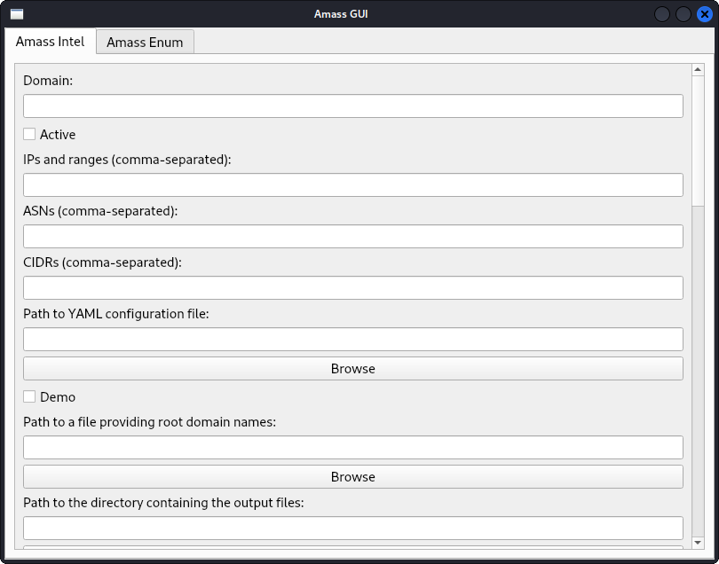

# Amass GUI -v 1.0.1

A graphical user interface (GUI) for OWASP Amass, developed by Alik Paranyan. This tool provides an easy-to-use interface for conducting network reconnaissance and information gathering using Amass.

## Features

- Supports both `amass intel` and `amass enum` commands.
- Easy browsing and selection of configuration files and directories.
- Real-time command execution output display.
- Comprehensive options to customize Amass commands.

## Installation

### Prerequisites

- Python 3.x
- PyQt5
- OWASP Amass

### Steps

1. **Clone the repository:**
    ```sh
    git clone https://github.com/alyaparan/amass-gui.git
    cd amass-gui
    ```

2. **Install the required Python packages:**
    ```sh
    pip install -r requirements.txt
    ```

3. **Run the application:**
    ```sh
    python amass_gui.py
    ```

## Usage

1. **Running Amass Intel:**
    - Open the "Amass Intel" tab.
    - Fill in the required fields and options.
    - Click on the "Run Amass Intel" button to execute the command.
    - The output will be displayed in the text area below.

2. **Running Amass Enum:**
    - Open the "Amass Enum" tab.
    - Fill in the required fields and options.
    - Click on the "Run Amass Enum" button to execute the command.
    - The output will be displayed in the text area below.

## Screenshot



## Contributing

- **Code of Conduct**: Please adhere to our [Code of Conduct](CODE_OF_CONDUCT.md) when contributing.
- **Contributing Guidelines**: Read the [Contributing Guidelines](CONTRIBUTING.md) before submitting pull requests.

## License

This project is licensed under the MIT License. See the [LICENSE](LICENSE) file for details.

## Contact

For questions or concerns, you can contact the project creator at:
- Website: [alikparanyan.com](http://www.alikparanyan.com)
- Email: [mail@alikparanyan.com](mailto:mail@alikparanyan.com)
- Personal Gmail: [alikparanyan@gmail.com](mailto:alikparanyan@gmail.com)

**Alik Paranyan**  
Cyber Security Specialist and Cyber Criminal Enthusiast

Feel free to contact me for any questions or feedback!
